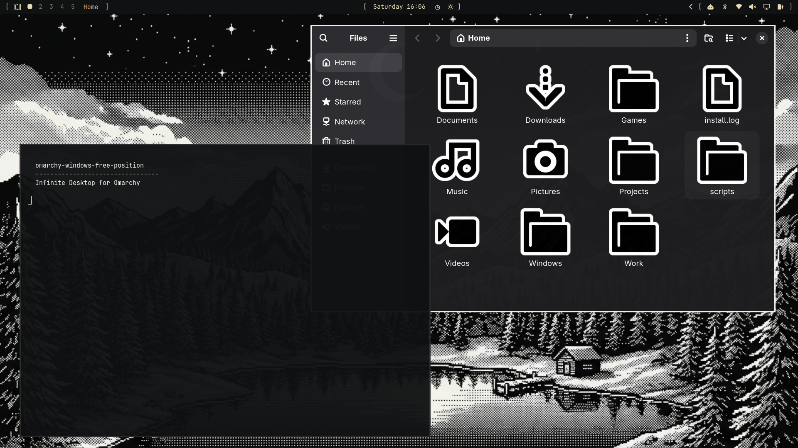
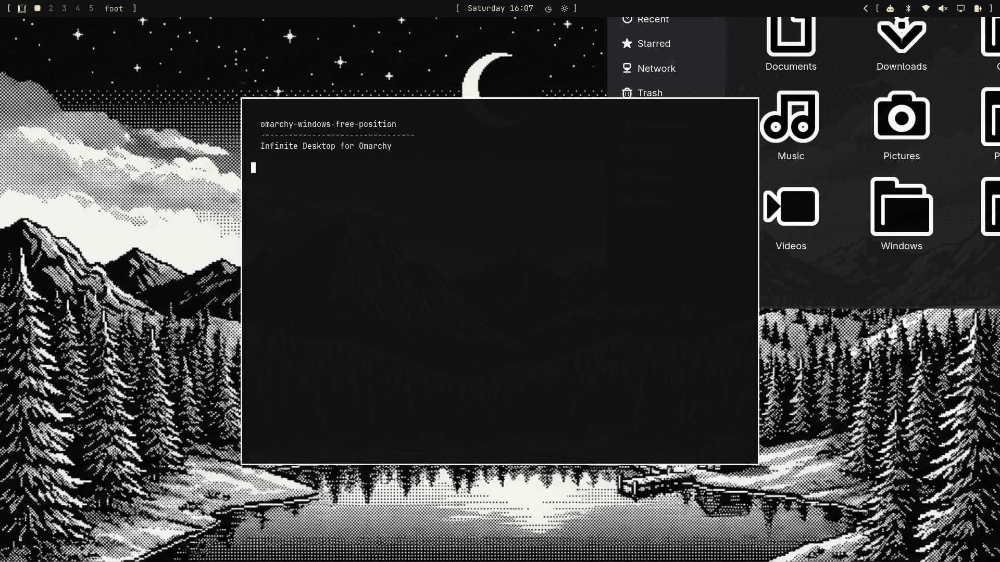

# omarchy-windows-free-position

Turn [Omarchy](https://omarchy.org/)'s Hyprland desktop into an "infinite canvas": pan all your floating windows around freely with the mouse or touchpad, jump between them with a keybind that smoothly centers and enlarges the one you land on, and keep your normal tiling workflow for everything else.

This is an **Omarchy-specific port and rewrite** of [sarodscommits/hyprland-infinite-desktop-v2](https://github.com/sarodscommits/hyprland-infinitie-desktop-v2), rebuilt to actually work with Omarchy's Lua-based Hyprland config (`hl.bind`, `o.bind`, `hl.config`, ...) instead of the classic `hyprland.conf` format. Several real bugs from the original were found and fixed along the way (see [What's different from the original](#whats-different-from-the-original-repo) below).

> **Note:** This project was built largely with AI assistance — [Claude Code](https://claude.com/claude-code) (Anthropic's AI coding assistant) did most of the porting, debugging and writing here, guided and reviewed by a human, and tested on a real Omarchy laptop before publishing.

## Screenshots

**Free positioning** — floating windows placed anywhere, overlapping, not confined to a tiling grid:



**Navigate & auto-focus** — jumping to a window centers the camera on it and grows it to a comfortable size (a real window resize, not a screen zoom — the bar, wallpaper and cursor are never touched):



## What it does

- **Super+Alt+drag** (mouse or touchpad) — pan the whole canvas: every floating window moves together, like scrolling around a big desk.
- **Super+click+drag** a window to a screen edge — the other floating windows slide out of its way.
- **Super+Alt+arrow** — focus the next window in that direction. The camera re-centers on it and it grows to fill roughly two-thirds of the screen (small windows zoom in more, large windows barely change) — a real `resize`, so nothing outside that one window is affected. With only one floating window open, it still centers/grows that one instead of doing nothing.
- **Super+D** — toggle every window on the workspace between floating and tiled.
- **Super+0** — manual escape hatch: snaps the currently-enlarged window back to its original size.
- **Super+Tab** — visual window switcher: the same image-gallery UI Omarchy uses for its background switcher, but showing a live screenshot of each open window instead of wallpapers. Pick one to pan/focus it. Replaces Omarchy's default "Next workspace" on that key. Requires Omarchy's `omarchy-menu-images` image-selector to be working — see the [note below](#a-note-on-supertab) if it doesn't open.
- **Super+M** — toggle new windows back to Omarchy's normal automatic tiling (and back again). Takes effect after your next login/reboot, not instantly — see [note below](#a-note-on-superm).
- New windows open floating by default, so they immediately join the canvas — placed next to your other open windows instead of stacking exactly on top of them, and the camera pans there automatically so you always see where it landed, even if that's a part of the canvas you'd scrolled away from.
- Closing a window follows the same idea in reverse: if Hyprland's automatic focus lands on another floating window somewhere else on the canvas, the camera pans there too, just like Super+Alt+arrow — so you never lose track of focus after a close.

Everything else (tiled windows, workspaces, the rest of Omarchy) works exactly as before.

## Requirements

- Omarchy (Arch-based, Hyprland with the Lua config — this does *not* work on classic `hyprland.conf` setups)
- `python-evdev`, `jq` (installed by the script)
- Your user needs to be in the `input` group (the installer does this; you must log out/reboot once for it to take effect)

## Install

```bash
git clone https://github.com/Hannes-swd/omarchy-windows-free-position.git
cd omarchy-windows-free-position
./install.sh
```

The installer:
1. Installs `python-evdev` and `jq` via `pacman`
2. Adds your user to the `input` group (needed to read raw mouse/touchpad/keyboard events)
3. Copies the scripts to `~/scripts/`
4. Appends a clearly-marked, backed-up block to `~/.config/hypr/autostart.lua`, `~/.config/hypr/hyprland.lua` and `~/.config/hypr/bindings.lua`

**After installing:** log out and back in (needed for the `input` group), then press **Super+K** to see all the new keybindings listed with descriptions.

The keybindings used were checked against a stock Omarchy install and don't collide with any default bind. If you've heavily customized your own `bindings.lua` already, double-check Super+K afterwards and adjust `~/.config/hypr/bindings.lua` if something collides — Hyprland doesn't reliably warn you about duplicate binds.

### Uninstall

Remove the block marked `>>> omarchy-windows-free-position (auto-installed) START` / `END` from the three config files listed above (or restore the `.bak.<timestamp>` files the installer created next to them), then `rm -rf ~/scripts` if you don't need the scripts anymore, and `sudo gpasswd -d $USER input` if you want to leave the `input` group.

## Keybindings

| Keys | Action |
|---|---|
| `Super+Alt` + drag mouse/touchpad | Pan the whole canvas |
| `Super` + click + drag to screen edge | Push other windows out of the way |
| `Super+Alt+←/→/↑/↓` | Focus + center + auto-resize the neighboring window |
| `Super+Shift+Ctrl+←/→/↑/↓` | Move the focused tiled window |
| `Super+Ctrl+Alt+H/J/K/L` | Move the focused floating window |
| `Super+Shift+Alt+H/J/K/L` | Resize the focused floating window |
| `Super+Z` / `Super+.` | Previous / next workspace |
| `Super+Shift+Z` / `Super+Shift+.` | Move window to previous / next workspace |
| `Super+D` | Toggle floating/tiled for every window on the workspace |
| `Super+0` | Reset the currently-enlarged window back to its original size |
| `Super+M` | Toggle auto-float for *new* windows on/off (applies after next login/reboot) |
| `Super+Tab` | Visual window switcher (live thumbnails) |

### A note on Super+Tab

`window_switcher.py` builds a full, uncropped thumbnail of every window, one at a time: if a window doesn't currently fit entirely inside the monitor (it's off-screen elsewhere on the canvas, or only partially visible), it's moved to the screen's corner just long enough to capture it, then moved straight back. Any *other* floating window that would otherwise cover that corner gets parked far offscreen for that same instant and moved right back — focusing a window alone doesn't reliably raise it above others here, so this is done positionally instead of relying on focus/stacking order. All of this happens per-window and is reverted before moving to the next one, so nothing ends up misplaced. It then hands the resulting images to Omarchy's own `omarchy-menu-images`/`omarchy-shell image-selector` — the exact picker UI used for `omarchy theme bg-switcher`. If that picker doesn't open for you (check with `omarchy theme bg-switcher` — if that hangs too, it's an Omarchy-side issue, not this tool), a `hyprctl reload`/logout or Omarchy update is more likely to fix it than anything here.

Each screenshot is cached in `~/.cache/omarchy-windows-free-position/window-switcher/`, keyed only by window address. Once a window has been captured, that image is reused every time you reopen the switcher — no matter how much it's since moved, resized, or its on-screen content changed — until the window is closed (which prunes its cache entry) and something with the same address opens fresh. Only genuinely *new* windows get captured; a warm run over already-seen windows is on the order of 40x faster than a cold one. The trade-off is a stale thumbnail for a window that's changed without closing — the speed was the point of asking for this over geometry-based invalidation.

### A note on Super+M

Hyprland's Lua window rules are additive and never get cleared on `hyprctl reload` — unlike keybinds, which do reset cleanly. That means flipping this toggle can't take effect immediately; it just flips a flag file (`~/.local/state/omarchy/toggles/infinite-desktop-autofloat-disabled`, using Omarchy's own `omarchy-toggle` flag convention) that's checked once, the next time `hyprland.lua` runs from scratch (login or reboot). The keybind sends a notification saying so instead of pretending it's instant. If you just want your *current* windows tiled again right now, use **Super+D** instead — that one is instant.

## How it works

- `scripts/infinite_desktop_core.py` runs in the background (autostarted), reads raw input events for keyboards, mice **and touchpads** (via `evdev`, auto-detected by device capabilities, no hardcoded device paths), and drives the pan/edge-push behavior directly through `hyprctl`.
- `scripts/navigate_windows.py` picks the next window in a direction, pans the canvas so it's centered, and resizes it based on how much of the screen it should fill.
- `scripts/smart_placement.py` runs in the background too (autostarted), listening on Hyprland's own event socket (`.socket2.sock`) for `openwindow` and `closewindow` events.
  - On `openwindow`, for a new floating window, it looks at the bounding box of the other floating windows already on that workspace — that's "the canvas", which can be anywhere after you've panned around, not necessarily the current view — and places the new one right up against one of them (with a small gap), picking whichever free spot is closest to the center of that bounding box. With no other windows open yet, it just falls back to the monitor's center. It then pans every floating window on that workspace by the same amount needed to bring the new window's spot to the actual center of your screen, so it's never opening somewhere you can't see. It also resizes the new window using the exact same formula `navigate_windows.py` uses when focusing one, so it's already at its "focused" size from the start - away-and-back navigation later doesn't cause a visible size jump, since applying that formula to a window already at the target size is a no-op.
  - On `closewindow`, it checks whatever Hyprland auto-focused next; if that's a floating window, it pans to center on it the same way Super+Alt+arrow would, so closing a window never leaves you looking at a part of the canvas with nothing in it.
- `scripts/window_switcher.py` builds a live thumbnail per open window (see the [Super+Tab note](#a-note-on-supertab)) and hands them to Omarchy's own image-selector for picking one.
- Everything else (`move_window.py`, `move_window_tiled.py`, `resize_window.py`, `floating_tile_toggle.py`, `reset_zoom.py`, `hypr_ipc.py`) are small focused helpers called from the keybindings.

## What's different from the original repo

The original project (a solid idea) targeted vanilla Hyprland and had a few issues that show up specifically on Omarchy:

- **Wrong config format**: it wrote to `hyprland.lua` using raw `hl.bind()` calls without descriptions and its own conflict-checker only scanned that one file — it never saw Omarchy's real default binds (which live in `/usr/share/omarchy/`), so several of its default keys silently collided with existing Omarchy shortcuts (arrow-key window focus, `Super+X`, etc). This port uses Omarchy's own `o.bind(keys, description, ...)` helper (so binds show up correctly under Super+K) and picks keys verified against a real Omarchy install.
- **No touchpad support**: the mouse-pan logic only understood `REL_X/REL_Y` (regular mice). Laptop touchpads report finger position as *absolute* coordinates (`ABS_X/ABS_Y`) through a separate device node — the original code silently never saw touchpad movement at all. This port detects touchpad devices by capability and converts absolute positions to relative deltas.
- **No HiDPI/fractional-scaling awareness**: window centering used the monitor's raw pixel resolution from `hyprctl monitors`, but window positions in Hyprland are in *logical* coordinates (`pixels / scale`). On any monitor with fractional scaling (e.g. 1.25x, 1.5x) windows would center off to one side instead of the true middle of the screen. Fixed by dividing by `scale` everywhere a monitor size is used.
- **Screen zoom instead of window resize**: an earlier version of the "zoom in on focus" feature used Hyprland's `cursor:zoom_factor`, which magnifies the *entire output* — bar, wallpaper, cursor, everything. It now does a real per-window resize instead, so nothing outside the target window is ever touched.
- **A stray "protected apps" list silently blocked focus**: a leftover safeguard from the original camera-pan design (meant to avoid disorienting jumps into browsers) made the navigate keybind quietly refuse to focus Chromium/Firefox/etc. Removed since it no longer applies once the camera-follow logic changed.
- **New windows opened full-screen-sized / browsers stayed tiled**: floating a window with no explicit size makes it inherit the size it would have had while tiled — for the first window on a workspace, that's the whole monitor. And Omarchy's own `browser.lua` force-tiles Chromium/Firefox-based windows, which silently overrode the float rule. Fixed with an explicit default size (`60% 60%`) and an override rule for the browser tags specifically.
- **A fullscreened window (Super+F) corrupted every other window's position**: while a window is fullscreen, Hyprland reports its `at`/`size` as the entire monitor instead of its real floating geometry — feeding that into the pan/placement math (as if it were a genuinely monitor-sized floating window) threw off the position of every other window as soon as you navigated, closed something, or opened something new. Fixed by excluding fullscreen windows from that math everywhere it happens (`navigate_windows.py`, `smart_placement.py`, `window_switcher.py`) — a fullscreen window is left alone entirely (never moved/resized/parked) until it exits fullscreen on its own.
- **Picture-in-picture, 1Password and similar popups would have been forced to 60%x60% too**: several Omarchy defaults deliberately size specific utility windows (PiP video overlays, the `floating-window` tag used by 1Password/Bitwarden-style popups, the webcam overlay, Steam, Battle.net, LocalSend, the About window) — the blanket float+size rule above is registered after those and would have overridden them, blowing a small PiP video up to most of the screen. Each of those sizes is re-asserted after the blanket rule so they stay as Omarchy designed them.

## Credits

Based on [sarodscommits/hyprland-infinitie-desktop-v2](https://github.com/sarodscommits/hyprland-infinitie-desktop-v2) — original idea and mouse-pan implementation. This repo is an Omarchy-specific port with the fixes described above.

## License

MIT — see [LICENSE](LICENSE). Based on [sarodscommits/hyprland-infinitie-desktop-v2](https://github.com/sarodscommits/hyprland-infinitie-desktop-v2) (MIT).
